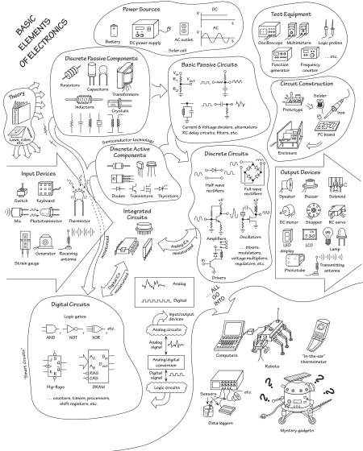
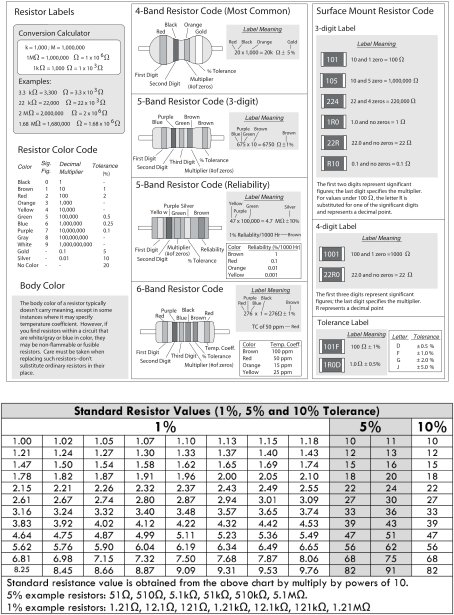
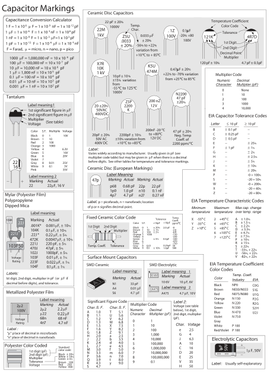

# Leksionet e Elektronikes
Elektronika viti 3...
në zhvillim ...

### Përmbajtja e këtij kursi në formë grafike

Figura e marrë nga libri: **"Practical Electronics for Inventors"**, Scherz & Monk, fourth edition, 2016

# Të gjitha komponentet bazike në elektronike

# Rezitencat bazike

# Kondensatorët bazike

Figurat e marra nga libri: **"Practical Electronics for Inventors"**, Scherz & Monk, fourth edition, 2016
