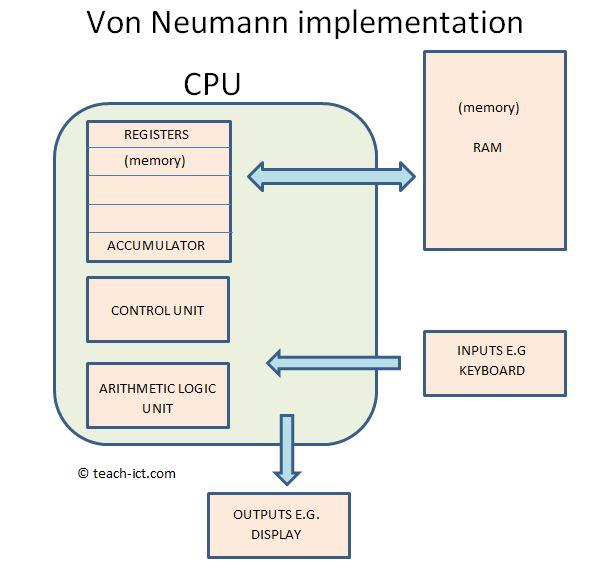
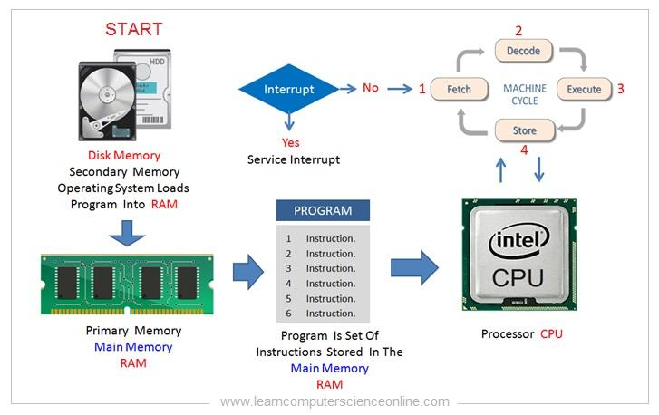
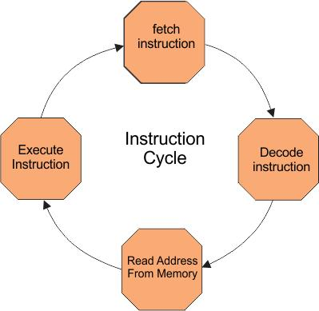
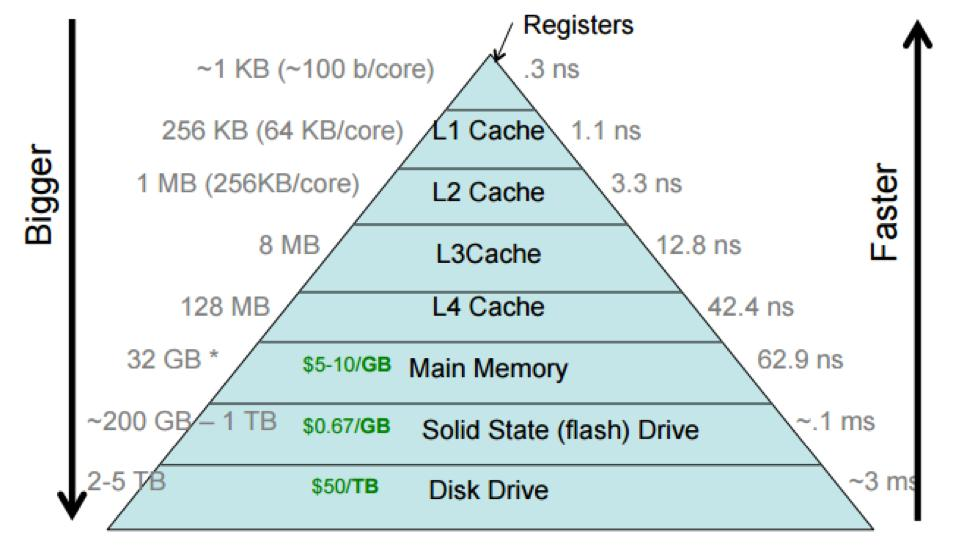

# **Appendix — Si ekzekutohet një program**

## **Ideja Themelore**

Një program kalon në këtë rrugë:

$$ \text{Disk} \;\rightarrow \; \text{RAM} \; \rightarrow \; \text{CPU} \quad (\text{kontrolluar/Menaguar nga OS}) $$

-   Disk → ruajtje
-   RAM → vendi ku programi jeton gjatë ekzekutimit
-   CPU → ekzekuton instruksionet
-   OS → menaxhon gjithçka

## **1. Komponentët**

-   **CPU** → ekzekuton instruksione (llogaritje + kontroll)
-   **RAM** → mban kodin dhe të dhënat gjatë ekzekutimit
-   **Cache** → memorie shumë e shpejtë brenda CPU
-   **Disk** → ruan programin para/pas ekzekutimit
-   **OS (Sistemi Operativ)** → krijon procesin, ndan burimet
-   **I/O** → komunikimi (psh periferikat si ekrani, tastiera, komunikimi në network etj)

## **2. Çfarë ndodh kur shtypim “Run”**

1.  Programi është në **disk**
2.  OS krijon një **proces**
3.  Programi ngarkohet në **RAM**
4.  CPU fillon ekzekutimin:
    -   Fetch → Decode → Execute
5.  OS mund ta ndërpresë (multitasking)
6.  Programi përfundon → memoria lirohet

Programi kalon nga disk → RAM → CPU dhe anasjelltas për rezultatet.

Çdo program është thjesht përsëritje e këtij cikli.

#### **Hierarkia e memories**

## **3. Pse është e rëndësishme për këtë laborator**

Koha e ekzekutimit ndikohet nga:

* **Algoritmi** (numri i operacioneve)
* **CPU** (shpejtësia)
* **Memoria** (akseset)
* **Cache** (lokaliteti i të dhënave)
* **OS** (ndërprerjet)

Prandaj matjet **nuk janë perfekte** dhe kanë variacion.

---

## **Mbani Mend**

Mendo programin si:

> Një listë instruksionesh që:
>
> * ruhen në RAM
> * ekzekutohen nga CPU
> * kontrollohen nga OS
> * dhe varen nga memoria dhe hardware

Një program është një **proces fizik në hardware**, jo vetëm kod abstrakt.

Kjo është arsyeja pse ne mund ta trajtojmë:

**si një eksperiment laboratorik me matje reale**

