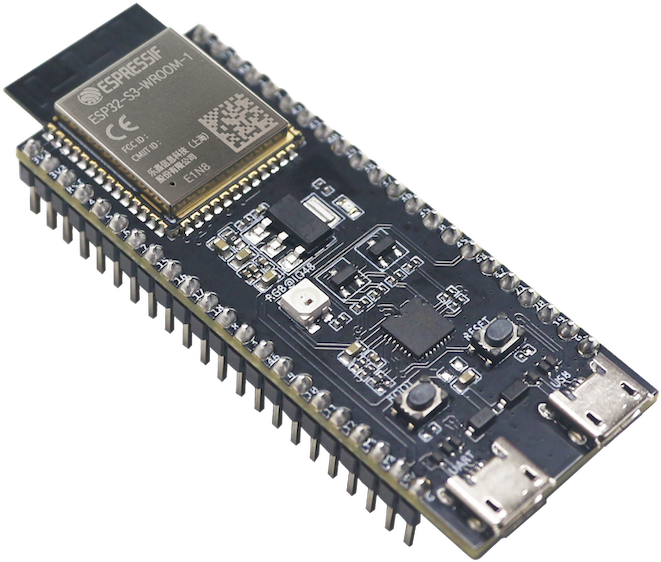
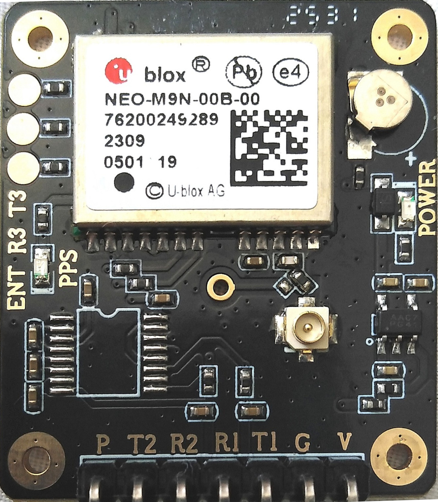

## ESP32-S3-DevKitC-1u

User guide for [ESP32-S3-DevKitC-1](https://docs.espressif.com/projects/esp-dev-kits/en/latest/esp32s3/esp32-s3-devkitc-1/user_guide_v1.1.html)

## UBLOX NEO M9N-00B

[Ublox NEO M9N-00B](https://www.u-blox.com/en/product/neo-m9n-module?legacy=Current#Documentation-&-resources)

