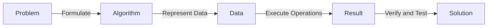

# Python

### Define Computer, Computation and Algorithm!

> [!IMPORTANT]
>
> **What is a Computer?**
>
> A computer is a machine that processes information according to a set of instructions. It can store, manipulate, and retrieve data efficiently.

> [!IMPORTANT]
>
> **What is Computation?**
>
> Computation is the process of solving problems or performing tasks by systematically manipulating data using logical, arithmetic, or algorithmic operations.

> [!IMPORTANT]
>
> **What is an Algorithm?**
>
> An algorithm is a step-by-step procedure or set of rules designed to solve a specific problem or perform a task. It is precise, finite, and can be implemented in a way that a machine (like a computer) can follow to achieve a desired result.

> [!NOTE]
>
> **Why do we need to Compute?**
>
> - We need computation and computers because they allow us to solve problems that are too complex, repetitive, or time-consuming for humans to handle manually.
> - Computation enables us to process large amounts of data, simulate physical systems, automate tasks, and explore solutions to problems in science, engineering, medicine, and beyond.
> - In essence, computation bridges the gap between ideas and actionable solutions, making it possible to achieve precision, scalability, and speed in nearly every field of human endeavor.

---

---

> [!NOTE]
>
> **To build a computer, we exploit and control physical phenomena**
>
> To construct a computer, a physical system must exhibit and allow control over phenomena that enable the following:
>
> 1. **Information Representation**: The system can encode discrete states to represent information (e.g., binary states like 0 and 1 as voltage levels, magnetic orientations, or quantum states).
> 2. **State Manipulation**: The system supports reliable transitions between states, enabling logical operations such as OR, AND, and NOT.
> 3. **State Preservation and Retrieval**: The system can store states stably and allows accurate measurement or retrieval of these states to recover information.
> 4. **Energy Utilization**: The system can be powered to drive state changes and sustain computational processes.

#### **Are electronics computers the only way to build computers?**

No. Research in **Quantum Computing** and **Unconventional Computing** explores alternative systems that leverage unique physical phenomena or natural processes to achieve greater efficiency, speed, or solve problems beyond classical computing's capabilities. Read [**Unconventional computing**](https://en.wikipedia.org/wiki/Unconventional_computing) for more details.

---

---

### Computational Problem-Solving Process (step-by-step):

1. We have a problem that is complex, repetitive, or time-consuming, which requires computation to solve effectively.
2. The problem is translated into an algorithm, a step-by-step procedure or set of rules designed to solve it.
3. The problem is represented using appropriate data types (e.g., integers, strings, lists) that store and process the necessary information.
4. The procedure is converted into a series of mathematical or logical operations on the data, which constitutes the computation.
5. The algorithm is then implemented in a programming language, making it understandable and executable by a computer.
6. The code is run and tested, often involving debugging to ensure it works correctly.
7. Finally, the result is obtained and verified, providing the solution to the problem.

---

> #### Formalized Computational Procedure:
>
> 1. **Problem Formulation:**
>    The first step is identifying and defining the problem clearly. The problem should be understood in such a way that it can be translated into computational terms. This involves recognizing the inputs, desired outputs, and constraints.
> 2. **Algorithm Design:**
>    An algorithm is a finite, well-defined sequence of steps that can solve the problem. The algorithm specifies the logic and operations that need to be performed to arrive at the solution.
> 3. **Data Representation:**
>    Once the algorithm is designed, data must be represented in a format suitable for processing by a computer. This involves selecting appropriate data structures (e.g., arrays, linked lists, dictionaries, graphs) that can efficiently store and manage the problem's data.
> 4. **Execution of Computation:**
>    The algorithm is translated into a programming language and executed on the computer. This step involves performing the operations (arithmetic, logical, and control flow operations such as loops, conditionals) on the data according to the algorithm's specifications.
> 5. **Output Generation:**
>    After the computations are performed, the algorithm produces a result, which is the solution to the problem. This result may be in the form of a numerical value, a data structure, or a visual representation.
> 6. **Verification and Testing:**
>    The final solution is tested and verified against the problem's constraints to ensure it is correct. If errors are found, the algorithm is refined or debugged.

---

#### Examples of the procedure:

##### Example 1: Finding the Sum of a List of Numbers

1. **Problem:** Calculate the sum of all numbers in the list, e.g. [3, 5, 2, 8, 6].
2. **Algorithm:**
   1. Initialize a sum variable to 0.
   2. Loop through each number in the list.
   3. Add each number to the sum.
   4. Return the sum.
3. **Data Representation:** Data structure, a list of numbers: [3, 5, 2, 8, 6]
4. **Execution of Computation (Operations):**
   1. Initialize sum = 0.
   2. Iterate over the list: [3, 5, 2, 8, 6].
   3. Add each number to the sum:
      - sum = sum + 3 → sum = 3
      - sum = sum + 5 → sum = 8
      - sum = sum + 2 → sum = 10
      - sum = sum + 8 → sum = 18
      - sum = sum + 6 → sum = 24
5. **Output Generation (Result):** The sum is 24.
6. **Verification and Testing:** Verify by manually adding the numbers: sum=3 + 5 + 2 + 8 + 6 = 24. The result is correct.

---

##### Example 2: Finding the Largest Number in a List

1. **Problem Formulation:** Find the largest number in the list e.g. [4, 7, 1, 9, 5].
2. **Algorithm:** 
   1. Initialize a variable `max` to the first element of the list.
   2. Loop through the list starting from the second element.
   3. If the current element is greater than `max`, update `max`.
   4. Return `max`.
3. **Data Representation:** A list of numbers [4, 7, 1, 9, 5].
4. Execution of Computation (Operations): 
   1. Initialize `max = 4` (first element).
   2. Iterate over the list starting from 7
      - Compare 7 with `max (4)`, update `max = 7`.
      - Compare 1 with `max (7)`, no change.
      - Compare 9 with `max (7)`, update `max = 9`.
      - Compare 5 with `max (9)`, no change.
5. **Output Generation (Result):** The largest number `max=9`.
6. **Verification and Testing:** Verify manually that the largest number in [4, 7, 1, 9, 5] is indeed 9. The result is correct!

---

##### Example 3: Checking if a Number is Even or Odd

1. **Problem Formulation:** Given a number, check whether it is even or odd.
2. **Algorithm:** 
   1. Divide the number by 2.
   2. If the remainder is 0, the number is even.
   3. If the remainder is 1, the number is odd.
3. **Data Representation:** A single integer, e.g., 5.
4. Execution of Computation (Operations):
   1. Check 5 % 2: the remainder is 1. (`%` operator is called modulus and return the reminder of division)
   2. Since the remainder is 1, the number is odd.
5. **Output Generation (Output):** The number 5 is odd.
6. Verification and Testing: Check manually that `5 % 2 = 1`, which confirms it is odd. The result is correct!

---

##### Example 4: Sorting a List of Numbers

1. **Problem Formulation:** Given a list of numbers, sort it in ascending order.
2. **Algorithm:**
   1. Loop through the list and compare each number with the next.
   2. Swap numbers if they are in the wrong order.
   3. Repeat the process until the list is sorted.
3. **Data Representation:** A list of numbers [5, 2, 9, 1, 5, 6].
4. **Execution of Computation (Operations):** 
   1. Compare 5 and 2, swap → [2, 5, 9, 1, 5, 6].
   2. Compare 5 and 9, no swap → [2, 5, 9, 1, 5, 6].
   3. Compare 9 and 1, swap → [2, 5, 1, 9, 5, 6].
   4. Continue swapping until the list is sorted → [1, 2, 5, 5, 6, 9].
5. **Output Generation:** The sorted list is [1, 2, 5, 5, 6, 9].
6. Verification and Testing: Verify sorting manually [5, 2, 9, 1, 5, 6] results [1, 2, 5, 5, 6, 9]. The result is correct!

---

#####  Example 5: Calculating the Kinetic Energy of an Object

1.  **Problem Formulation:**  Calculate the kinetic energy $E_k$ of a point-like particle given its mass $m$ and its velocity $\vec{v}$.
2. **Algorithm:**
   1. Obtain the mass $m$ and the velocity $\vec{v}$ of the object.
   2. Utilize the formula $E_k=\frac{1}{2} m\,\vec{v}^2$.
   3. Return the value of $E_k$.
3. **Data Representation:** Data structure are real numbers, $m=2.5 {\rm kg}$ and $v=1.3 {\rm m/s}$.
4. **Execution of Computation (Operations):** The kinetic energy is $E_k=\frac{1}{2} 2.5 \times 1.3^2=2.1125{\rm J}$.
5. **Output Generation:** Result is $E_k=2.1125{\rm J}$.
6. **Verification and Testing:** Doing it manually or with a calculator will give $E_k=\frac{1}{2} 2.5 \times 1.3^2=2.1125{\rm J}$. The results matches, therefore, the result is correct!

---

---

### **Turing Machine Definition**:

A **Turing machine** is a theoretical model of computation that can simulate any algorithm or computation process. It was introduced by **Alan Turing** in 1936 to formalize the concept of computation.

A Turing machine consists of:

1. **Tape**: 
   - An infinite sequence of cells, each of which can hold a symbol. The tape is unbounded, meaning it extends infinitely in both directions, providing an infinite amount of memory.

2. **Head**: 
   - A device that can read from and write to the tape. The head can move **left** or **right** along the tape one cell at a time.

3. **State Register**: 
   - A register that holds the current state of the machine. The machine’s operation depends on the current state and the symbol being read by the head.

4. **Finite Set of States**: 
   - A set of predefined states that the machine can be in, including a **start state** and one or more **accept/reject states**.

5. **Transition Function**: 
   - A set of rules (or a table) that dictates how the machine behaves. Given the current state and the symbol under the head, the transition function specifies:
     - The next state of the machine.
     - The symbol to write on the tape.
     - The direction in which the head should move (left or right).

#### Operation:

The Turing machine operates by:

1. Reading the symbol on the current tape cell.
2. Based on the symbol and the current state, it uses the transition function to:
   - Write a new symbol on the tape (or leave the current symbol unchanged).
   - Move the head left or right.
   - Change its state.

The process repeats until the machine reaches a **halting state** (either **accept** or **reject**), indicating the end of the computation.

#### Significance:

A Turing machine is considered a **universal model of computation**, as it can simulate any computer algorithm or function, given sufficient time and memory. It forms the foundation of the **theory of computation** and provides a formal framework for understanding **computational problems** and **complexity**.

### Real Computer vs. Turing Machine:

A modern **computer** is essentially a practical implementation of a Turing machine. Both:

- Use **input**, perform **computations**, and produce **output**.
- Have **memory** (the computer has RAM or storage, and the Turing machine has its infinite tape).
- Follow a **set of instructions** or algorithms to solve problems.

However, unlike a Turing machine, which is a theoretical model, a computer has **finite resources** (limited memory, processing power) and operates within physical constraints. But in terms of **computational power**, both a real computer and a Turing machine can perform the same class of computations, as any computation a computer can do, a Turing machine can do, and vice versa.

In summary, while a Turing machine is an abstract concept, a computer is a physical realization that **simulates** the behavior of a Turing machine with limited resources.

---

---

### Algorithm Efficiency:

Algorithm efficiency refers to how well an algorithm performs in terms of **time** and **space** resources. It is typically analyzed in terms of:

1. **Time Complexity**: 
   - Describes how the runtime of an algorithm changes as the size ($n$) of the input grows. It's usually expressed using **Big-O notation** (e.g.,  $O(n)$, $O(n^2)$, etc.), which provides an upper bound on the growth rate of the algorithm’s execution time.
   
2. **Space Complexity**: 
   - Describes how the memory usage of an algorithm grows with the size of the input. Similar to time complexity, space complexity is also analyzed using **Big-O notation** (e.g., $O(1)$, $O(n)$).

### Key Points:

- **More efficient algorithms** typically run faster and require less memory, making them preferable for larger inputs.
- An algorithm’s efficiency is crucial for **scalability**, especially when dealing with large datasets or complex problems.

In simple terms, efficient algorithms solve problems **faster** and **with fewer resources**, making them more practical for real-world applications.

#### Examples:

#### a) Searching Algorithm

Searching algorithms try to find if a target value (x) is element of a list. 

1. **Linear Search  - O(n)**: *Naive searching by sequentially scans each element in the list.*
2. **Binary Search - O(log n)**: *Efficiently searches in sorted data by halving the search space.*

**Linear Search**

This is a straightforward approach where we sequentially check each element of the array to find the target.
**Steps:**

1. Start from the first element in the array.
2. Compare the current element with the target value.
3. If the current element matches the target, stop and return the index of the element.
4. If not, move to the next element and repeat the process.
5. If the end of the array is reached without finding the target, conclude that the target is not in the array.

**Illustration**

* Array: `[3, 1, 4, 1, 5]`, Target: `4`
* Steps:
  * Check index 0: 3 ≠ 4
  * Check index 1: 1 ≠ 4
  * Check index 2: 4 = 4 → Found at index 2. 

**Binary Search**

This is an efficient method that works only on sorted arrays. It repeatedly divides the search space in half.

1. Start from the first element in the array.
2. Compare the current element with the target value.
3. If the current element matches the target, stop and return the index of the element.
4. If not, move to the next element and repeat the process.
5. If the end of the array is reached without finding the target, conclude that the target is not in the array.

**Illustration**

* Sorted Array: [1, 3, 4, 5, 7, 9], Target: 5 (array has n=6 elements and indexes 0-5)
* Steps:
  * Check middle element (index 2): 4 ≠ 5 → Target is greater, search [5, 7, 9].
  * Check middle element (index 3): 5 = 5 → Found at index 3.

#### b) Sorting Algorithm

1. **Bubble Sort - O(n²)**: *Naive Sorting Algorithm*
2. **Merge Sort - O(n log n)**: *Efficient Sorting Algorithm*

**Bubble Sort**

This algorithm repeatedly compares adjacent elements and swaps them if they are in the wrong order.

**Steps:**

1. Start from the beginning of the array.
2. Compare each pair of adjacent elements:
   * If the current element is greater than the next element, swap them.
   * Otherwise, leave them as is.
3. Continue this process for the entire array.
4. After each full pass, the largest unsorted element will be at its correct position.
5. Repeat the process for the remaining unsorted portion of the array until no swaps are needed.

**Illustration:**

* Array: [4, 3, 2, 1]
* Steps:
  * Pass 1: Compare and swap → [3, 2, 1, 4]
  * Pass 2: Compare and swap → [2, 1, 3, 4]
  * Pass 3: Compare and swap → [1, 2, 3, 4]

**Merge Sort**

This algorithm uses a divide-and-conquer strategy to recursively divide the array into smaller parts, sort them, and merge them back together.

**Steps:**

1. Divide the array into two halves.
2. Recursively repeat step 1 for each half until each part contains a single element.
3. Merge the sorted halves together:
   * Compare the smallest elements of both halves.
   * Place the smaller element into the merged array.
   * Repeat until all elements are merged.

**Illustration:**

* Array: [4, 3, 2, 1]
* Steps:
  * Divide: [4, 3] and [2, 1] → [4] [3] and [2] [1]
  * Merge: [3, 4] and [1, 2] → [1, 2, 3, 4]

---

---

## Learning a New Programming Language: Beginner's Guide

When starting with a new programming language, focus on these key areas:

#### 1. **Syntax and Basics**

- Learn how to:
  - **Declare variables.**
  - **Write functions.**
  - **Use loops (`for`, `while`).**
  - **Make decisions with conditionals (`if`, `else`).**

#### 2. **Data Types and Structures**

- Understand:
  - Basic types: **numbers, strings, booleans.**
  - Collections (containers): **lists, arrays, dictionaries** (or similar).

#### 3. **Error Handling**

- Study how the language manages errors, such as using `try` and `catch` or similar mechanisms.

#### 4. **Programming Paradigms**

- Identify if the language supports:
  - **Object-Oriented Programming (OOP)**: Classes, objects.
  - **Functional Programming**: Higher-order functions and immutability.

#### 5. **Libraries and Tools**

- Explore:
  - The **standard library for built-in functionalities**.
  - Popular tools and frameworks that enhance productivity.

#### 6. **Environment Setup**

- Learn how to:
  - Use an **Integrated Development Environment (IDE).**
  - Run programs and debug errors effectively.

#### 7. **Community and Documentation**

- Use resources like:
  - Official documentation.
  - Online forums, tutorials, and communities.

#### 8. **Practice**

- Apply your learning by:
  - Working on small projects.
  - Solving practice problems to strengthen your understanding.

---

**Tip:** Start simple and gradually build your knowledge as you get comfortable with the language! 

